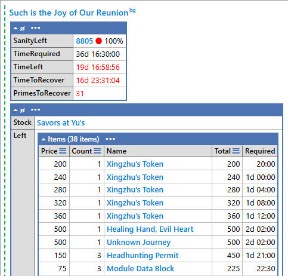
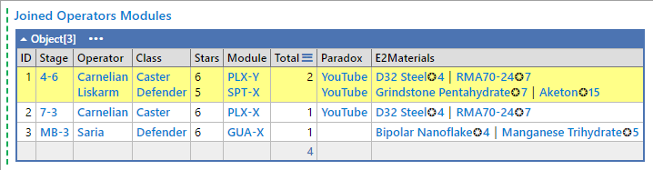

# Arknights LINQPad scripts

[](https://github.com/i2van/ArknightsLINQPad/actions)
[](https://opensource.org/licenses/MIT)
[](https://arknights.wiki.gg)
[](https://www.linqpad.net/Download.aspx)
[](https://www.linqpad.net/LINQPad8.aspx#beta)

Collection of the [Arknights](https://arknights.wiki.gg) [LINQPad 8](https://www.linqpad.net) ([Windows only](https://forum.linqpad.net/discussion/1983/roadmap-for-cross-platform-ubuntu-linux)) scripts.

## Requirements

[LINQPad 8](https://www.linqpad.net/Download.aspx) or [LINQPad 8 Latest Beta](https://www.linqpad.net/LINQPad8.aspx#beta) (recommended) with the [latest](https://dotnet.microsoft.com/en-us/download/dotnet/latest) [.NET](https://dotnet.microsoft.com/en-us/download/dotnet) installed.

## How to use

1. [Download ZIP](https://github.com/i2van/ArknightsLINQPad/archive/refs/heads/main.zip) or `git clone` repository.
2. Open [script](#scripts) in the [LINQPad 8](https://www.linqpad.net/Download.aspx).
3. Search (`Ctrl+F`) for all the `TODO:`s and edit as necessary.
4. Execute.

## Scripts

### [EventStatus.linq](https://github.com/i2van/ArknightsLINQPad/blob/main/EventStatus.linq)

Ongoing [Arknights](https://arknights.wiki.gg) [event](https://arknights.wiki.gg/wiki/Event) status tracker.



### [EventStockParser.linq](https://github.com/i2van/ArknightsLINQPad/blob/main/EventStockParser.linq)

[Arknights](https://arknights.wiki.gg) [event](https://arknights.wiki.gg/wiki/Event) stock parser.

```csharp
[new("To_the_Grinning_Valley#Sandbeast's_Cave", "To the Grinning Valley", "Spicy_Bottletree_Sap")] = new("""
// To the Grinning Valley
350		Major Field
10	7	Information Fragment
100		Module Data Block
30	8	Data Supplement Instrument
10	40	Data Supplement Stick
200		Crystalline Electronic Unit
65		Chip Catalyst
50	2	Polymerized Gel
20	4	Aketon
20	4	Semi-Synthetic Solvent
5	10	LMD
5	5	Strategic Battle Record
5	5	Tactical Battle Record
5	5	Skill Summary - 3
5	5	Skill Summary - 2
4	5	Pure Gold
6	5	Oriron
30	5	Recruitment Permit
4	10	Furniture Part
""")
```

### [OperatorModules.linq](https://github.com/i2van/ArknightsLINQPad/blob/main/OperatorModules.linq)

[Arknights](https://arknights.wiki.gg) [operators](https://arknights.wiki.gg/wiki/Operator)'s [modules](https://arknights.wiki.gg/wiki/Operator_Module) missions.



### [OperatorModulesParser.linq](https://github.com/i2van/ArknightsLINQPad/blob/main/OperatorModulesParser.linq)

[Arknights](https://arknights.wiki.gg) [operators](https://arknights.wiki.gg/wiki/Operator)'s [modules](https://arknights.wiki.gg/wiki/Operator_Module) parser.

```text
Aak	Specialist	6	GEE-X	2-8	D32 Steel❂4｜Polymerized Gel❂7	Paradox
Absinthe	Caster	5	CCR-X	3-4	Orirock Concentration❂10｜Incandescent Alloy❂10
Aciddrop	Sniper	4	ARC-X	2-8	RMA70-12❂10｜Integrated Device❂8	Paradox
Akafuyu	Guard	5	MUS-X	3-8	Polymerized Gel❂8｜Aketon❂15	Paradox
Almond	Specialist	5	HOK-X	BI-2	Oriron Block❂6｜Manganese Ore❂13	Paradox
Ambriel	Sniper	4	DEA-X	4-7	Oriron Cluster❂16｜RMA70-12❂6
Amiya	Caster	5	CCR-Y	3-8	Orirock Concentration❂10｜Loxic Kohl❂10
Andreana	Sniper	5	DEA-X	3-2	Grindstone Pentahydrate❂8｜RMA70-12❂8
Angelina	Supporter	6	DEC-X	2-7	Bipolar Nanoflake❂4｜Sugar Lump❂5	Paradox
Angelina	Supporter	6	DEC-Y	4-4	Bipolar Nanoflake❂4｜Sugar Lump❂5	Paradox
...
```

### [OriginitePrimePacks.linq](https://github.com/i2van/ArknightsLINQPad/blob/main/OriginitePrimePacks.linq)

[Arknights](https://arknights.wiki.gg) [packs store](https://arknights.wiki.gg/wiki/Packs_Store) [Originite Prime](https://arknights.wiki.gg/wiki/Originite_Prime) price calculator.


